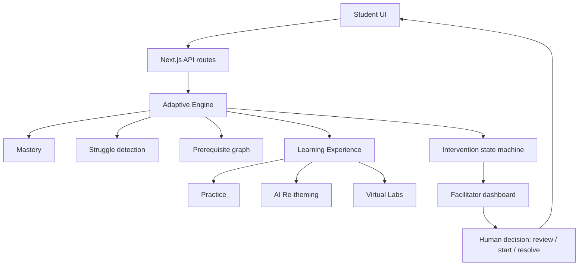

# AURA Learn — Architecture (judge-friendly)

## The shape of the system

```text
Student UI (Next.js App Router, React Server + Client Components)
    ↓
Next.js API routes (/api/practice, /api/attempts, /api/labs/*, /api/interventions, /api/ai/*)
    ↓
Adaptive Engine (lib/engine.ts orchestrates, in a fixed order, after every learning event)
    ├── Mastery       (lib/mastery.ts)      quiz accuracy + recent performance + prerequisite
    │                                        mastery + retention + lab performance
    ├── Struggle       (lib/struggle.ts)     repeated errors + low accuracy + excessive time
    │                                        + prerequisite weakness + hint dependency
    ├── Prerequisites  (lib/curriculum.ts)   the topic graph; a topic unlocks only when every
    │                                        prerequisite reaches 60% mastery
    └── Interventions  (lib/intervention.ts) a state machine: detected → recommended → viewed
                                              → started → responding → resolved
    ↓
Learning Experience
    ├── Practice        real questions, graded server-side, never against themed text
    ├── AI Re-theming    same question, personalized narrative — see below
    └── Virtual Labs     real interactive HTML/JS labs, result feeds the same Mastery engine
    ↓
Facilitator (reads the same store; sees WHO / WHY / WHAT NEXT for every open case)
    ↓
Human intervention (review → start helping → resolve — a person decides, not the AI)
    ↓
Student (sees the updated case status the next time they open a question)
```



## The one loop everything runs through

Every learning event — a graded answer *or* a completed lab — runs through the exact same
`runAdaptiveCycle` in that fixed order: recompute mastery → adapt question difficulty → recompute
struggle → check prerequisites → evaluate the intervention → compute any newly-unlocked topics →
log an audit event for each change. There is one mastery model, one struggle model, one
intervention state machine — a lab result and a quiz answer both feed the identical pipeline, not
parallel copies of it.

## AI detects/recommends, humans decide

The struggle detector and intervention engine are **plain weighted arithmetic**, not a model call —
the numbers behind "Struggle = 25% repeated errors + 25% low accuracy + 20% excessive time + 15%
prerequisite weakness + 15% hint dependency" are computed the same way every time and are fully
inspectable in the "Insights" tab. AI is used in exactly one place: rewriting a question's *story*
around a student's interest. AI never:

- grades an answer — grading always runs against the original, authored question, never the
  themed text a student is shown;
- decides mastery, struggle, or whether a topic unlocks — those are deterministic formulas;
- resolves an intervention on its own once a facilitator has started working with the student — a
  human closes those cases.

## AI re-theming pipeline (and why it can't break the lesson)

```text
cached, previously-validated rewrite
    ↓ (miss)
live provider (OpenRouter / Groq / Gemini / NVIDIA — exactly one, per AI_PROVIDER)
    ↓ (unavailable, times out, or fails validation)
deterministic built-in theme (same guardrails apply)
    ↓ (no built-in theme for this question, or that also fails)
the original, authored question
```

Every step returns the exact same shape; the student never sees which one answered. The generated
text is only ever a story: the request the model receives is a **structured** object (stem,
learning objective, variables, formula, unit, correct answer, difficulty) and it is only permitted
to change vocabulary/setting, never a number. Whatever comes back — from any of the four providers
— passes through the same validator before a student ever sees it: exact numbers, exact units,
exact variables, the same concept, no answer leakage, unmodified MCQ options, the same difficulty
and learning objective. If anything fails even one check, that response is discarded and the
pipeline moves to the next step. This is why the provider abstraction (four HTTP clients behind one
interface) never had to touch the validator, the cache, the circuit breaker or the rate limiter —
they are provider-agnostic by construction.

## Virtual labs feed real signals, not vanity numbers

Labs are ordinary sandboxed HTML/JS pages (`public/labs/*.html`) that report a real score and
mistake count through a small bridge script (`AURA.complete({score, mistakes})`). That score is
weighted at a fixed 10% of the mastery formula alongside quiz accuracy, recent performance,
prerequisite mastery and retention — it is never allowed to instantly "complete" a topic: a topic
with zero prior question attempts scores 0 regardless of lab performance, by construction.

## Persistence

A single file-backed JSON store (`data/store.json`), chosen deliberately for a 24-hour prototype so
every number on screen is inspectable and the whole demo state resets to a known scenario in one
call. This is why it needs a persistent Node process (a VPS, Render, Railway, a container with a
volume) rather than a serverless/edge platform — see `.env.example` for the Supabase migration this
was designed to make straightforward later.

## What is genuinely "the product" here

Not the AI. The **feedback loop** — performance → mastery → struggle → intervention →
personalization → facilitator visibility → back to the student — is the product. AI makes one link
in that loop (the question's narrative) more relevant to a specific learner; the loop works, and is
fully tested, with AI turned completely off.
