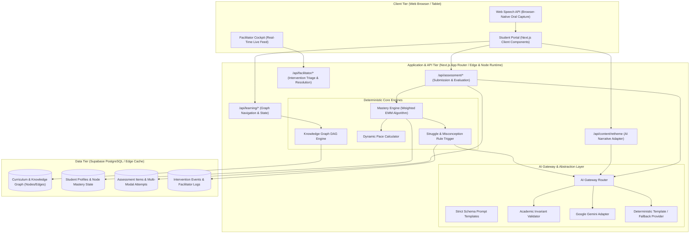
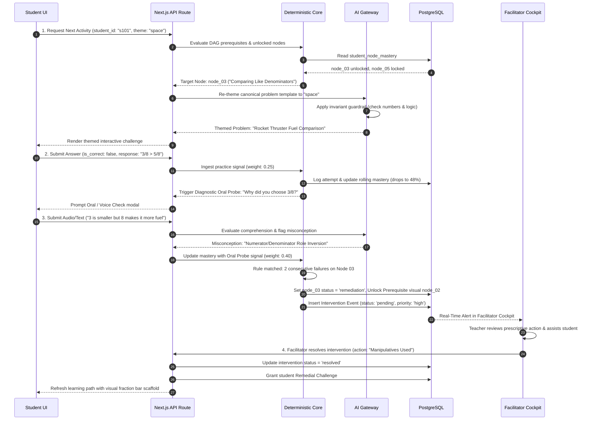
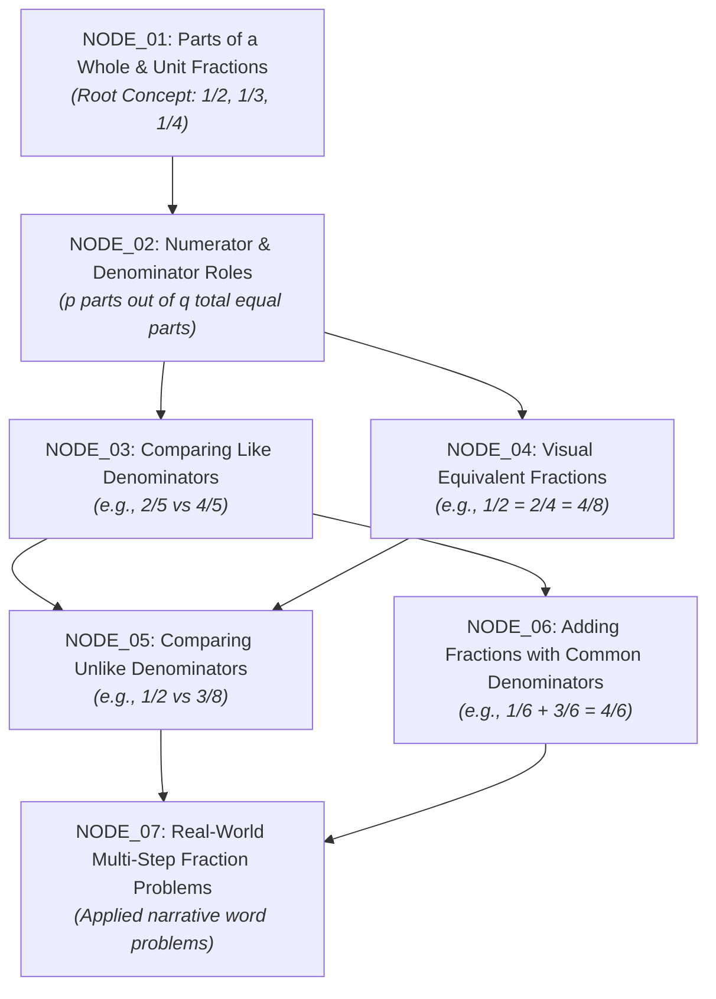
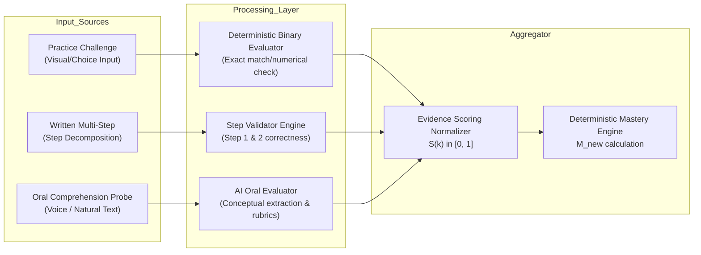
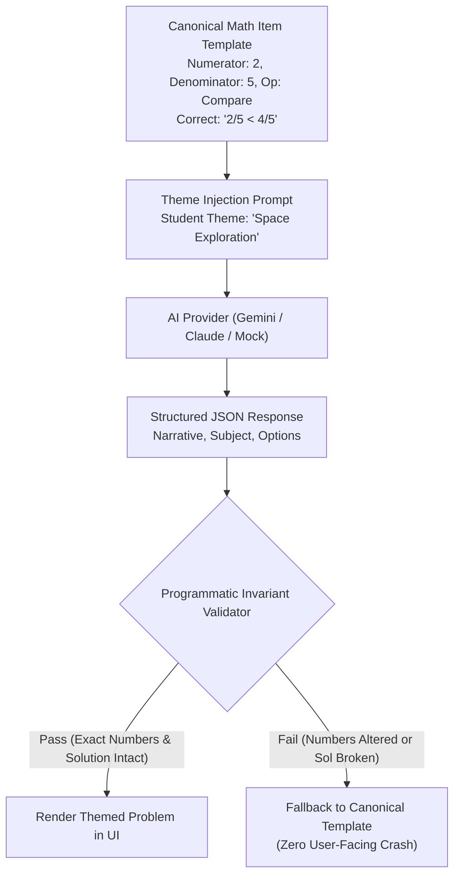

# System Architecture Document
## Project: KEA — Adaptive Learning & Real-Time Intervention Platform
**Architecture Version**: 1.0.0 (Hackathon Production Baseline)  
**Primary Tech Stack**: Next.js 14/15 (App Router, TypeScript), Tailwind CSS, shadcn/ui, Supabase (PostgreSQL)  
**Author**: Lead Product Architect & System Orchestrator  

---

## 1. High-Level System Architecture

The KEA platform is architected as an event-driven, fullstack TypeScript application centered on a **Deterministic Learning State Core** surrounded by an **AI Context Engine** and a **Real-Time Facilitator Cockpit**.



---

## 2. Major Components & Responsibilities

| Component | Responsibility | Failure Boundary & Isolation |
|---|---|---|
| **Knowledge Graph DAG Engine** | Computes topological prerequisites, validates mastery unlocks, and reroutes paths to ancestor nodes upon failure. | 100% deterministic TypeScript. Zero external API dependencies. |
| **Mastery Calculation Engine** | Ingests multi-modal assessment signals (Practice, Written, Oral) and updates concept-level mastery using weighted exponential moving updates. | Deterministic math. Auditable formulas with zero non-deterministic drift. |
| **Dynamic Pace Engine** | Computes real-time engagement tempo (*Falcon*, *Cheetah*, *Panda/Sloth*) based on attempt velocity and mastery acceleration. | Strictly non-punitive. Visual label only; never directly gates curriculum. |
| **AI Context Re-themer** | Transforms canonical math problem templates into student-preferred narrative themes (Space, Wildlife, Chef, Superhero). | Isolated behind `Invariant_Checker`. If LLM alters numbers or variables, fallback to canonical template instantly. |
| **AI Oral Probe Evaluator** | Ingests transcribed student natural language, flags conceptual misconceptions (e.g., whole-number denominator bias), and produces diagnostic evidence. | If offline or latency $> 2.5\text{s}$, gracefully falls back to structured multiple-choice diagnostic. |
| **Intervention Dispatcher** | Monitors struggle rules ($\ge 2$ consecutive failures + drop below $60\%$ mastery) and compiles prescriptive teacher intervention cards. | Deterministic trigger; LLM enriches script, but base pedagogical prompt is pre-templated. |
| **Facilitator Cockpit** | Live triage dashboard for classroom teachers with real-time status updates and one-click remediation actions. | Direct Supabase real-time subscription or responsive polling. |

---

## 3. End-to-End Data Flow (The Golden Loop)



---

## 4. Curriculum & Knowledge Graph Representation

The curriculum for Class 4 Mathematics (Fractions) is formally structured as a Directed Acyclic Graph (DAG) $G = (V, E)$, where $V$ represents discrete conceptual competencies and $E$ represents directed prerequisite dependencies $(u \rightarrow v)$, meaning concept $u$ must be mastered before attempting concept $v$.

### 4.1 Node Hierarchy & Dependencies



### 4.2 Graph Gating & Traversal Rules
1. **Unlocking Condition**: A node $v$ is unlocked if and only if:
   $$\forall u \in \text{Prerequisites}(v), \quad \text{Mastery}(u) \ge 0.80$$
2. **Remediation Rerouting**: If a student experiences repeated struggle ($\ge 2$ consecutive failed assessments or $\text{Mastery}(v) < 0.60$), the graph engine:
   - Sets status of node $v$ to `REMEDIATION_HOLD`.
   - Identifies the most immediate ancestor node $u \in \text{Prerequisites}(v)$ with the lowest mastery score.
   - Injects a **Remedial Visual Scaffold** targeted at node $u$'s foundational misconception.

### 4.3 Dynamic AI Topic-to-Knowledge-Graph Pipeline
For arbitrary user-entered topics (e.g., Python, Calculus, Quantum Computing), KEA generates candidate concept graphs dynamically via Gemini and validates them against the deterministic Knowledge Graph Engine:

```
User Topic ("Python")
        ↓
Next.js API Route (POST /api/topic/plan)
        ↓
Gemini API (@google/genai / gemini-2.5-flash) [Server-Side Only]
        ↓
Structured JSON Schema Validation (2-6 stages, 3-16 concepts)
        ↓
Referential Integrity Check (All prerequisite IDs exist, no self-references)
        ↓
KnowledgeGraphEngine.validateNodes() (Deterministic Kahn's DAG cycle detection)
        ↓
Normalized TopicCurriculumPlan
        ↓
Client Stage Cards + Learning Map UI
```

- **Provider Boundary**: `TopicPlanner` interface abstracts `GeminiTopicPlanner` and `FallbackTopicPlanner`.
- **Fail-Safe Resilience**: If API keys are unconfigured, rate-limited, or offline, `FallbackTopicPlanner` provides verified canonical plans (Python, Calculus, ML, Photosynthesis) or dynamic synthesis, guaranteeing zero UI failure.
- **Security**: `GEMINI_API_KEY` is strictly accessed server-side and never bundled in client code.

---

## 5. Mastery Calculation & Adaptive Pace Logic

### 5.1 Deterministic Mastery Calculation (Weighted EMM Algorithm)
Mastery is never determined by an LLM prompt. It is calculated through a deterministic, auditable **Weighted Exponential Moving Mastery (W-EMM)** function that ingests multi-modal assessment signals.

Each assessment type carries an empirical reliability weight reflecting depth of comprehension:
- **Practice Question ($w_P = 0.25$)**: Rapid-fire item (multiple choice or numeric input). Prone to lucky guessing.
- **Written / Structured Step-by-Step ($w_W = 0.35$)**: Multi-step decomposition verifying procedural steps.
- **AI-Assisted Oral Probe ($w_O = 0.40$)**: Natural language reasoning probe testing genuine conceptual understanding.

#### Formula:
When a new assessment attempt $k$ is submitted on node $i$:
$$M_{i}^{(k)} = (1 - \lambda \cdot w_t) \cdot M_{i}^{(k-1)} + (\lambda \cdot w_t) \cdot S^{(k)}$$
Where:
- $M_{i}^{(k)} \in [0.0, 1.0]$ is the updated mastery score.
- $M_{i}^{(0)}$ is initialized to $0.0$ (or baseline diagnostic score).
- $\lambda = 0.5$ is the learning rate parameter.
- $w_t \in \{w_P, w_W, w_O\}$ is the weight of the assessment format.
- $S^{(k)} \in [0.0, 1.0]$ is the normalized score of the attempt.

#### Mastery Status States:
- **Locked ($M < 0.80$ on parent)**: Prerequisite criteria unmet.
- **In Progress ($0.0 \le M < 0.60$)**: Initial learning and formative practice.
- **Progressing ($0.60 \le M < 0.80$)**: Approaching threshold; targeted practice queued.
- **Mastered ($M \ge 0.80$)**: Node completed, unlocks downstream dependencies.
- **Struggling / Remediation ($M < 0.60$ with consecutive failures)**: Auto-escalated to teacher dashboard.

### 5.2 Dynamic Learning Pace Calculation
Pace reflects the child's **current interaction velocity**, not their innate intelligence or permanent track.

$$\text{Pace Index } P = \frac{\Delta \text{Mastery}}{\text{Attempts Count} \times \log(1 + \Delta \text{Time Minutes})}$$

| Pace Label | Friendly Persona Mascot | Operational Behavior |
|---|---|---|
| **Falcon** | 🦅 Speedy Skyward | Rapid progression. Low error rate. System skips redundant drills and unlocks enrichment word challenges. |
| **Cheetah** | 🐆 Steady Explorer | Standard pacing. Healthy balance of first-time success and corrective practice. |
| **Sloth / Panda** | 🐼 Thoughtful Wanderer | Deliberate, exploratory pace. High working-memory load. System injects additional visual bar models and decreases text density. |

> **Critical Ethical Guardrail**: The pace label is explicitly surfaced as an energetic mascot celebrating current rhythm. It never restricts content access or shows negative indicators.

---

## 6. Multi-Modal Assessment Pipeline



### 6.1 The Oral Assessment / Comprehension Probe
When a student answers incorrectly twice or enters a borderline mastery zone ($0.60 \le M < 0.75$), the system triggers an Oral Probe:
1. **Audio Capture**: Browser-native `SpeechRecognition` (Web Speech API) transcribes speech to text in real time with zero external API latency or streaming overhead. A clean keyboard/typing option is always accessible side-by-side.
2. **AI Semantic Evaluation**: The transcribed string is passed to the AI abstraction layer with a strict JSON schema:
```json
{
  "conceptual_understanding_score": 0.35,
  "articulates_key_principle": false,
  "identified_misconception": "whole_number_denominator_bias",
  "evidence_quote": "Because 8 is bigger than 4 so 1/8 gives you more pieces",
  "encouraging_child_feedback": "You noticed 8 is a big number! But remember, cutting a pizza into 8 slices makes each slice smaller than cutting into 4."
}
```

---

## 7. AI Context Re-Theming & Invariant Preservation Pipeline

### 7.1 The Re-Theming Challenge
Children learn faster when problems are framed around their personal passions. However, naive LLM generation often introduces hallucinations: altering numerical answers, shifting difficulty, or breaking mathematical validity.

### 7.2 The 3-Stage Invariant Preservation Architecture



#### The Programmatic Invariant Validator:
Before any AI-generated problem is served to the student, a deterministic TypeScript validator executes three checks:
1. **Number Bag Invariant**: Extracts all digits and fractions via regex `(\d+/\d+|\d+)` from the generated text and ensures the multiset matches the canonical problem definition.
2. **Operator & Objective Invariant**: Confirms the question target ("compare", "add", "identify parts") remains identical.
3. **Key Equivalence Invariant**: Verifies the correct option index matches the original answer key.

---

## 8. Real-Time Intervention Detection & Facilitator Workflow

### 8.1 Struggle Detection Rules (Deterministic Trigger)
An intervention is created in the database if ANY of the following deterministic conditions are satisfied:
1. **Rule 1 (Repeated Failure)**: 2 consecutive incorrect submissions on the same concept node.
2. **Rule 2 (Chronic Under-Mastery)**: $\ge 4$ total attempts with mastery remaining $< 55\%$.
3. **Rule 3 (High-Confidence Misconception)**: AI Oral Probe flags a known foundational misconception (e.g., `whole_number_denominator_bias` or `numerator_denominator_inversion`).

### 8.2 Prescriptive Facilitator Card (Human-in-the-Loop)
Unlike passive analytics dashboards that merely highlight red numbers, KEA generates a **Prescriptive Intervention Action Brief**:
- **Student**: Aarav Sharma (Class 4-B)
- **Node**: NODE_03 (Comparing Like Denominators)
- **Diagnosed Misconception**: Whole-Number Denominator Bias
- **Severity**: High (Repeated in Oral Probe)
- **Actionable 3-Minute Facilitator Script**:
  1. *Physical Tool*: Hand Aarav the wooden/plastic 1-whole and two $1/4$ strips vs four $1/8$ strips.
  2. *Dialogue Prompt*: *"Ask Aarav: If you and 7 friends share a pizza vs you and 3 friends, which slice is bigger?"*
  3. *Verification*: Have him place the $1/4$ tile directly on top of the $1/8$ tile.
- **Action Buttons**: `Acknowledge` | `Mark Remediated & Unlock Scaffold` | `Dismiss`

---

## 9. Database Design (PostgreSQL / Supabase Schema)

```sql
-- KEA Relational PostgreSQL Schema

-- 1. Profiles (Students & Facilitators)
CREATE TABLE profiles (
    id UUID PRIMARY KEY DEFAULT gen_random_uuid(),
    auth_user_id UUID UNIQUE,
    full_name TEXT NOT NULL,
    role TEXT NOT NULL CHECK (role IN ('student', 'facilitator')),
    grade_level INT DEFAULT 4,
    avatar_url TEXT,
    created_at TIMESTAMPTZ DEFAULT NOW()
);

-- 2. Student Learning Profile State
CREATE TABLE student_learning_profiles (
    id UUID PRIMARY KEY DEFAULT gen_random_uuid(),
    student_id UUID NOT NULL REFERENCES profiles(id) ON DELETE CASCADE,
    selected_theme TEXT DEFAULT 'space' CHECK (selected_theme IN ('space', 'wildlife', 'chef', 'superhero')),
    current_pace_label TEXT DEFAULT 'cheetah' CHECK (current_pace_label IN ('sloth', 'cheetah', 'falcon')),
    current_pace_score NUMERIC(5, 2) DEFAULT 1.0,
    active_streak_days INT DEFAULT 1,
    total_xp INT DEFAULT 0,
    updated_at TIMESTAMPTZ DEFAULT NOW(),
    CONSTRAINT unique_student_profile UNIQUE (student_id)
);

-- 3. Knowledge Graph Nodes
CREATE TABLE knowledge_nodes (
    id TEXT PRIMARY KEY, -- e.g., 'NODE_01_PARTS'
    code TEXT NOT NULL UNIQUE,
    title TEXT NOT NULL,
    description TEXT,
    grade_level INT NOT NULL DEFAULT 4,
    chapter_name TEXT NOT NULL DEFAULT 'Fractions',
    order_index INT NOT NULL,
    mastery_threshold NUMERIC(3, 2) DEFAULT 0.80,
    created_at TIMESTAMPTZ DEFAULT NOW()
);

-- 4. Knowledge Graph Prerequisite Edges (DAG)
CREATE TABLE knowledge_edges (
    id UUID PRIMARY KEY DEFAULT gen_random_uuid(),
    source_node_id TEXT NOT NULL REFERENCES knowledge_nodes(id) ON DELETE CASCADE,
    target_node_id TEXT NOT NULL REFERENCES knowledge_nodes(id) ON DELETE CASCADE,
    edge_type TEXT NOT NULL DEFAULT 'prerequisite' CHECK (edge_type IN ('prerequisite', 'enrichment')),
    CONSTRAINT unique_graph_edge UNIQUE (source_node_id, target_node_id)
);

-- 5. Student Node Mastery (Evolving Learning State)
CREATE TABLE student_node_mastery (
    id UUID PRIMARY KEY DEFAULT gen_random_uuid(),
    student_id UUID NOT NULL REFERENCES profiles(id) ON DELETE CASCADE,
    node_id TEXT NOT NULL REFERENCES knowledge_nodes(id) ON DELETE CASCADE,
    mastery_score NUMERIC(4, 3) DEFAULT 0.0 CHECK (mastery_score >= 0.0 AND mastery_score <= 1.0),
    status TEXT NOT NULL DEFAULT 'locked' CHECK (status IN ('locked', 'unlocked', 'in_progress', 'mastered', 'remediation')),
    consecutive_failures INT DEFAULT 0,
    total_attempts INT DEFAULT 0,
    last_evaluated_at TIMESTAMPTZ DEFAULT NOW(),
    CONSTRAINT unique_student_node_mastery UNIQUE (student_id, node_id)
);

-- 6. Canonical Assessment Items
CREATE TABLE assessment_items (
    id UUID PRIMARY KEY DEFAULT gen_random_uuid(),
    node_id TEXT NOT NULL REFERENCES knowledge_nodes(id) ON DELETE CASCADE,
    item_type TEXT NOT NULL CHECK (item_type IN ('practice', 'written', 'oral')),
    canonical_question TEXT NOT NULL,
    canonical_options JSONB, -- Array of choices for MCQ/interactive
    canonical_solution JSONB NOT NULL, -- Correct answer, numeric fraction, or step breakdown
    rubric_criteria JSONB, -- Evaluation criteria for oral probes
    difficulty TEXT DEFAULT 'medium' CHECK (difficulty IN ('easy', 'medium', 'hard'))
);

-- 7. Student Assessment Attempts (Evidence Trail)
CREATE TABLE student_assessment_attempts (
    id UUID PRIMARY KEY DEFAULT gen_random_uuid(),
    student_id UUID NOT NULL REFERENCES profiles(id) ON DELETE CASCADE,
    item_id UUID NOT NULL REFERENCES assessment_items(id) ON DELETE CASCADE,
    node_id TEXT NOT NULL REFERENCES knowledge_nodes(id) ON DELETE CASCADE,
    raw_response JSONB NOT NULL,
    is_correct BOOLEAN NOT NULL,
    evidence_score NUMERIC(3, 2) NOT NULL,
    oral_transcript TEXT,
    oral_evaluation_json JSONB,
    applied_theme TEXT,
    created_at TIMESTAMPTZ DEFAULT NOW()
);

-- 8. Facilitator Interventions (Human-in-the-Loop Cockpit)
CREATE TABLE interventions (
    id UUID PRIMARY KEY DEFAULT gen_random_uuid(),
    student_id UUID NOT NULL REFERENCES profiles(id) ON DELETE CASCADE,
    node_id TEXT NOT NULL REFERENCES knowledge_nodes(id) ON DELETE CASCADE,
    facilitator_id UUID REFERENCES profiles(id),
    trigger_reason TEXT NOT NULL, -- e.g., 'CONSECUTIVE_FAILURES', 'ORAL_MISCONCEPTION'
    misconception_tag TEXT,
    evidence_summary TEXT,
    prescriptive_action_plan JSONB NOT NULL, -- Manipulative suggestion, dialogue script
    status TEXT NOT NULL DEFAULT 'pending' CHECK (status IN ('pending', 'acknowledged', 'resolved', 'dismissed')),
    created_at TIMESTAMPTZ DEFAULT NOW(),
    resolved_at TIMESTAMPTZ
);

-- Indexes for Rapid Query Execution
CREATE INDEX idx_student_node_mastery ON student_node_mastery(student_id, node_id);
CREATE INDEX idx_interventions_status ON interventions(status, created_at DESC);
CREATE INDEX idx_assessment_attempts ON student_assessment_attempts(student_id, node_id, created_at DESC);
```

---

## 10. API Boundaries & Interface Contracts

All endpoints are built as Next.js Route Handlers (`src/app/api/...`) with end-to-end TypeScript types and strict request body validation.

### 10.1 `GET /api/learning/state?studentId={id}`
Returns student's active node, graph progress map, current pace mascot, and unlocked pathways.
```typescript
interface LearningStateResponse {
  student: {
    id: string;
    name: string;
    theme: 'space' | 'wildlife' | 'chef' | 'superhero';
    pace: { label: 'sloth' | 'cheetah' | 'falcon'; mascot: string };
  };
  graph: Array<{
    nodeId: string;
    title: string;
    status: 'locked' | 'unlocked' | 'in_progress' | 'mastered' | 'remediation';
    masteryScore: number;
    prerequisites: string[];
  }>;
  currentNode: {
    id: string;
    title: string;
    chapter: string;
  };
}
```

### 10.2 `POST /api/assessment/submit`
Ingests an assessment attempt, executes deterministic mastery calculation, updates graph edges, and triggers struggle detection.
```typescript
interface AssessmentSubmitPayload {
  studentId: string;
  itemId: string;
  nodeId: string;
  itemType: 'practice' | 'written' | 'oral';
  response: any;
  oralTranscript?: string;
}

interface AssessmentSubmitResponse {
  isCorrect: boolean;
  score: number;
  newMasteryScore: number;
  newStatus: 'in_progress' | 'mastered' | 'remediation';
  nodeUnlocked?: string;
  interventionTriggered: boolean;
  feedback: string;
}
```

### 10.3 `POST /api/content/retheme`
Requests an AI-rethemed version of a canonical math challenge for the student's chosen passion theme.
```typescript
interface RethemePayload {
  canonicalItemId: string;
  targetTheme: 'space' | 'wildlife' | 'chef' | 'superhero';
}

interface RethemeResponse {
  themingSuccess: boolean;
  thematicContext: string; // e.g. "Commander Leo's Rocket Fuel Tanks"
  rethemedQuestion: string;
  options: Array<{ id: string; label: string; text: string }>;
  invariantCheckPassed: boolean;
}
```

### 10.4 `POST /api/facilitator/resolve-intervention`
Allows the teacher to mark an intervention as completed with remediation notes.
```typescript
interface ResolveInterventionPayload {
  interventionId: string;
  facilitatorId: string;
  resolutionType: 'manipulatives_used' | 'one_on_one_explained' | 'scaffold_assigned';
  notes?: string;
}
```

---

## 11. AI Abstraction Layer & Provider Architecture

### 11.1 The Vendor-Neutral AI Gateway Contract (`src/lib/ai/ai-provider.ts`)
To decouple KEA from any specific model vendor, all LLM operations implement the unified `AIProvider` interface:

```typescript
export interface AIProvider {
  readonly name: ProviderName; // 'gemini' | 'groq' | 'nvidia-nim' | 'fallback'
  isConfigured(): boolean;
  healthCheck(): Promise<ProviderHealthResult>;
  generateText(prompt: string, options?: GenerationOptions): Promise<string>;
  generateStructured<T>(
    prompt: string,
    schema: z.ZodType<T>,
    options?: GenerationOptions
  ): Promise<T>;
  generateInterviewTurn(
    prompt: string,
    options?: GenerationOptions
  ): Promise<InterviewTurnEvaluation>;
}
```

### 11.2 Multi-Tier Provider Cascade & Fallback Resilience
1. **Primary Provider (Gemini)**: Google Gemini (via official `@google/genai` SDK or REST). Ultra-fast reasoning and structured JSON output.
2. **Secondary Provider (Groq)**: OpenAI-compatible ultra-low-latency LPU (`llama-3.3-70b-versatile` / `llama3-8b-8192`).
3. **Tertiary Provider (NVIDIA NIM)**: Enterprise-grade accelerated inference endpoints (`meta/llama-3.1-70b-instruct`) using OpenAI REST format.
4. **Deterministic Fallback Provider (Zero-API Fail-Safe)**: Complete zero-network pedagogical fallback covering all Organic Chemistry stages (1–5), functional group reactions, catalytic hydrogenation mechanisms, dynamic practice generation, and adaptive interview turns.

Provider cascade flow:
$$\text{Gemini} \xrightarrow{\text{fail / unconfigured}} \text{Groq} \xrightarrow{\text{fail / unconfigured}} \text{NVIDIA NIM} \xrightarrow{\text{fail / unconfigured}} \text{Deterministic Fallback}$$

### 11.3 Self-Healing & Schema Validation
All structured generation passes through strict Zod schemas (`src/lib/ai/schemas.ts`). If an LLM returns malformed JSON or invalid types, the `AIOrchestrator` automatically triggers a bounded 1-shot repair prompt containing the validation error before falling back to the next provider.

### 11.4 AI Observability & Zero Credential Leakage
Every AI execution tracks `ExecutionMetadata` (provider name, model, duration, fallback used, repair retries). An inspection badge (`AI ● LIVE`, `AI ● FALLBACK`, `DEMO MODE`) and telemetry drawer are available in the UI. Server-side environment variables (`GEMINI_API_KEY`, `GROQ_API_KEY`, `NVIDIA_NIM_API_KEY`) are strictly forbidden from browser bundles or debug logs.

---

## 12. Frontend Architecture & Design System

### 12.1 Layout & Component Hierarchy
- **Next.js App Router Structure**:
  - `src/app/(student)/learn/page.tsx`: The primary child-facing interactive learning canvas.
  - `src/app/(student)/profile/page.tsx`: Theme picker, mascot showcase, streak, and mastery badges.
  - `src/app/(facilitator)/dashboard/page.tsx`: Real-time teacher triage feed, class pace distribution, and intervention action cards.
- **Component Primitives**: Built on **shadcn/ui** and **Radix UI** primitives styled with **Tailwind CSS**.
- **Visual Aesthetic & Theme Support**:
  - Full **Dark & Light Mode** support via `next-themes`.
  - Palette: Curated vibrant jewel-tones tailored for primary school clarity (Deep Space Indigo, Emerald Forest, Warm Amber, Radiant Purple).
  - Micro-animations via CSS keyframes and Framer Motion for mastery unlock celebrations.
- **Audio Capture Component**: Pure browser-native HTML5 audio & Web Speech API (`webkitSpeechRecognition`). Includes instant animated waveform visualizer and keyboard typing alternative.

---

## 13. Security, Privacy & Child Protection (COPPA / GDPR-K)

Given the primary target audience of Class 1–6 children:
1. **Zero PII Exposure to LLMs**: Student real names, birthdates, and emails are scrubbed before any text is dispatched to AI providers. The prompt receives only pseudonymous identifiers (e.g., "Student-A", "Class 4").
2. **Audio Streaming Privacy**: Speech recognition is executed locally inside the user's browser client via the Web Speech API. Raw voice audio files are not recorded or saved to disk.
3. **Child-Safe Content Boundaries**: The AI re-theming prompt enforces strict content guardrails: no violence, weapons, competitive shaming, or mature themes.

---

## 14. Deployment Architecture

- **Web Application & Edge Handlers**: Vercel (Edge & Node.js Serverless Functions).
- **Relational Database**: Supabase Hosted PostgreSQL with instant connection pooling via Supabase client.
- **Local Dev / Offline Demo Ready**: Built-in mock database provider with in-memory state or local SQLite compatibility so judges can clone and execute `npm run dev` with zero setup.

---

## 15. Technology Choices & Justification Matrix

| Technology Choice | Evaluated Alternative | Decisive Rationale for Hackathon MVP |
|---|---|---|
| **Next.js Fullstack (TS)** | Python / FastAPI Backend | Next.js API Routes run deterministic TypeScript logic directly. Eliminates dual deployments, CORS configuration, separate JWT handling, and cross-repo serialization bugs. |
| **Supabase PostgreSQL** | MongoDB / Prisma SQLite | Built-in real-time subscriptions for instant facilitator dashboard updates, rock-solid relational integrity for DAG edges, and instant schema deployment. |
| **Tailwind + shadcn/ui** | Plain CSS / Material UI | Radically faster UI assembly with accessible primitives, effortless dark/light mode, and custom playful primary-school aesthetics. |
| **Web Speech API** | OpenAI Whisper API Server | Zero latency, zero external API costs, works natively in browser without complex WebAssembly or multipart audio upload endpoints. |
| **Deterministic EMM** | LLM-as-a-Judge for Mastery | Mastery calculations must be auditable, repeatable, and fast. LLMs are non-deterministic, slow, and expensive for continuous numerical scoring. |

---

## 16. Critical Architecture Review & Challenge (Addressing the 14 Checkpoints)

1. **Does it satisfy ALL 4 architectural deliverables in the problem statement?**  
   *Yes*: (1) Prerequisite knowledge graph and deterministic mastery gating; (2) Adaptive pace and dynamic tempo mascots; (3) Multi-modal assessment triangulation; (4) Real-time facilitator intervention cockpit.
2. **Is the MVP genuinely buildable in 24 hours?**  
   *Yes*: The curriculum is constrained to 1 grade (Class 4) and 1 chapter (Fractions: 7 nodes). The tech stack is unified TypeScript.
3. **Have we introduced unnecessary services?**  
   *No*: Rejected separate Python backend, Vector DBs, real-time image diffusion, and Redis caches.
4. **Can the core journey be demonstrated in 5 minutes?**  
   *Yes*: A pre-seeded student account (Aarav) triggers a targeted struggle on Node 03 within 3 clicks, generating the teacher card immediately.
5. **Can every AI decision be explained by a human developer?**  
   *Yes*: The prompt contracts and extraction schemas are fixed and inspectable in TypeScript types.
6. **What happens if the AI API fails?**  
   *Resilient*: The `Fallback_Provider` automatically serves pre-templated themed questions and keyword-heuristic oral rubrics.
7. **What happens if Supabase access fails?**  
   *Resilient*: An in-memory demo mock state is provided for offline testing.
8. **Are mastery and progression decisions deterministic and auditable?**  
   *Yes*: Governed by the Weighted Exponential Moving Mastery formula.
9. **Can the system demonstrate genuine adaptation rather than just random questions?**  
   *Yes*: Struggling on unlike denominators actively locks downstream addition and re-routes the student backwards to visual equivalent fraction bars.
10. **Does the intervention provide an ACTIONABLE recommendation?**  
    *Yes*: Provides a physical manipulative tool guide and a 3-minute dialogue script for the teacher.
11. **Is the knowledge graph actually used to control progression?**  
    *Yes*: Hard programmatic gating based on DAG ancestor mastery.
12. **Does AI re-theming preserve academic logic?**  
    *Yes*: Validated by the programmatic `Invariant_Checker`.
13. **Is the architecture simple enough for another developer to understand?**  
    *Yes*: Standard Next.js directory structure, clean separation of concerns, and typed models.
14. **Which features were cut to preserve demo excellence?**  
    *Cuts*: Multi-grade curriculum, generative video/images, native mobile apps, automated TTS voice synthesis, and multi-tenant district hierarchies.
