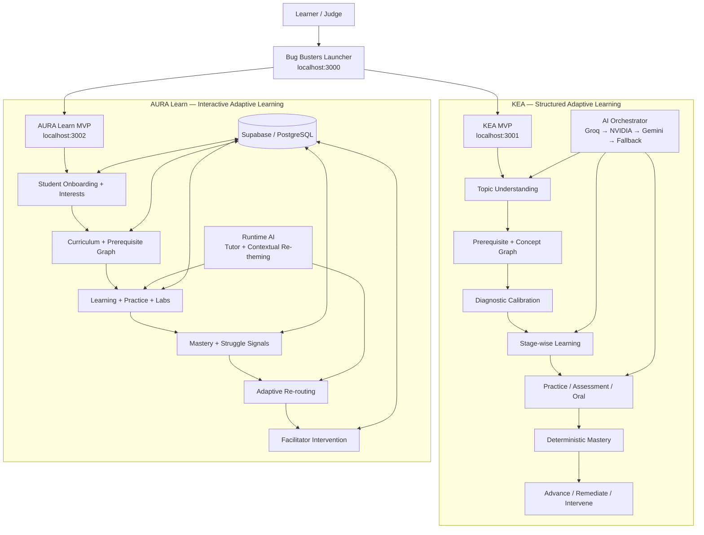
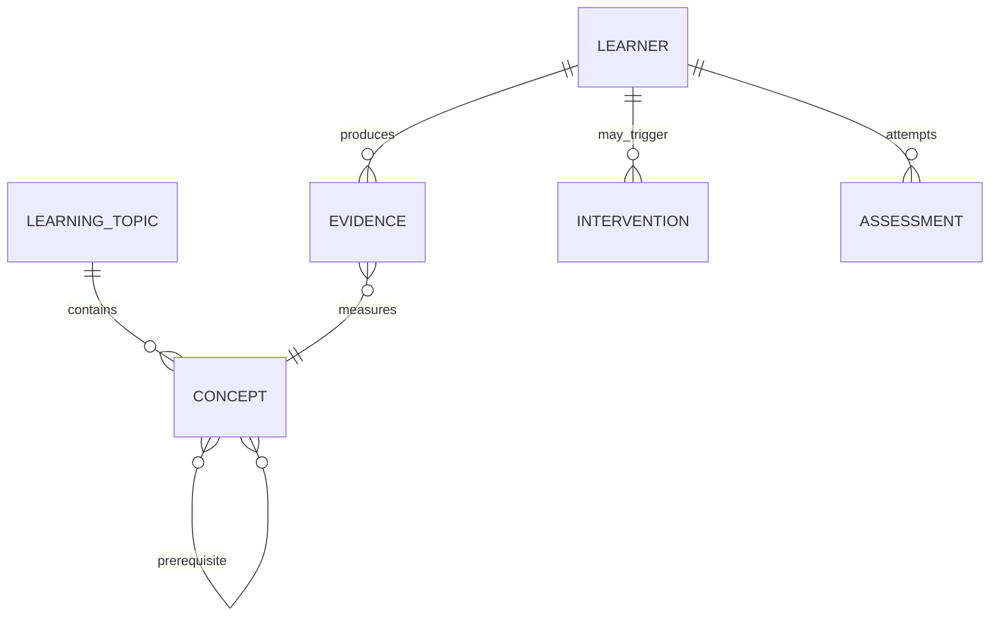
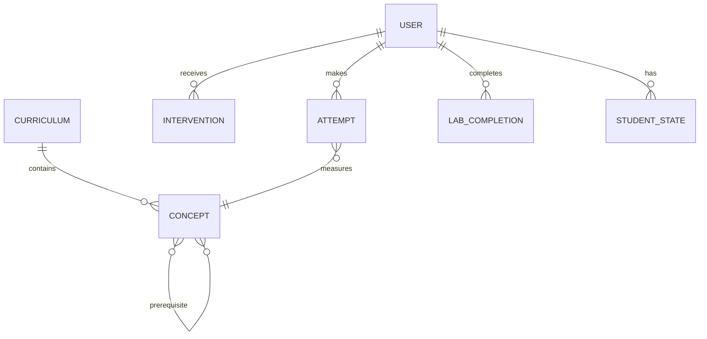

# Architecture

**Team:** Bug Busters  
**Team ID:** HM26-1E71  
**Project:** KEA × AURA Learn  
**Domain:** Adaptive Learning & Real-Time Intervention

## System Overview

Bug Busters currently ships **two independent adaptive-learning MVPs** plus a small launcher. They share the same problem space and product vision, but they do not share application code or runtime state.



### Architecture Principle

```text
AI generates / interprets
        ↓
Deterministic learning logic validates and controls progression
        ↓
Learner evidence updates the next learning action
```

KEA and AURA Learn implement this principle independently with different UX and runtime architectures.

---

## Product Boundaries

| Product | Role | Runtime | Primary Interaction Style |
|---|---|---|---|
| **KEA** | Open topic-to-mastery adaptive learning platform | Next.js application | Structured, monochrome, graph- and mastery-driven |
| **AURA Learn** | Interactive adaptive learning environment | Next.js application | Visual, interactive, lab- and engagement-driven |
| **Launcher** | Product selector only | Next.js application | Unified Bug Busters entry point |

The launcher does not merge the products. It navigates to the independently running applications.

---

# KEA Architecture

## KEA Request / Learning Walkthrough

A typical KEA journey is:

```text
Learner enters a topic
        ↓
AI topic understanding
        ↓
Concept + prerequisite generation
        ↓
Schema / referential / DAG validation
        ↓
Diagnostic calibration
        ↓
Personalized stage-wise plan
        ↓
Visual / interactive learning
        ↓
AI practice + milestone assessment
        ↓
Deterministic mastery calculation
        ↓
Advance / remediation / facilitator intervention
        ↓
Next concept
```

### Example: Organic Chemistry

```text
Carbon Fundamentals
        ↓
Hydrocarbon Foundations
        ↓
Functional Groups
        ↓
Structure & Isomerism
        ↓
Reactions & Practical Application
```

The chemistry slice includes interactive molecular structures, graph navigation, visual learning workspaces, reaction visualizers, builders, classifiers, and assessment-driven progression.

## KEA Components

| Component | Responsibility | Tech | Code location |
|---|---|---|---|
| Topic Entry | Captures open-ended learner goal and starts the journey | React / Next.js | `Hack Mysuru 1.0/src/components/entry/` |
| AI Topic Planner | Generates candidate concepts, stages, objectives, and prerequisites | TypeScript + AI providers | `Hack Mysuru 1.0/src/lib/ai/` |
| Knowledge Graph | Validates DAG structure, prerequisites, unlocking, and traversal | Deterministic TypeScript | `Hack Mysuru 1.0/src/lib/knowledge-graph/` |
| Diagnostic Engine | Evaluates prerequisite/current-knowledge alignment | Deterministic TypeScript | `Hack Mysuru 1.0/src/lib/diagnostic/` |
| Learning Generator | Produces personalized lessons, examples, misconceptions, practice and hints | AI orchestration | `Hack Mysuru 1.0/src/app/api/learning/` + `src/components/ai/` |
| Assessment Engine | Generates and evaluates mock tests and short-answer reasoning | AI + deterministic checks | `Hack Mysuru 1.0/src/app/api/assessment/` |
| Mastery Engine | Calculates mastery from evidence; controls progression | Deterministic TypeScript | `Hack Mysuru 1.0/src/lib/mastery/` |
| Oral / Interview Engine | Handles spoken/text reasoning and multi-turn evaluation | Web Speech API + AI | `Hack Mysuru 1.0/src/app/api/oral/` + `src/app/api/interview/` |
| Intervention Engine | Detects sustained struggle and produces facilitator-facing intervention state | Deterministic TypeScript | `Hack Mysuru 1.0/src/lib/intervention/` |
| Chemistry Engine | Validates molecules and curated reaction transformations | Deterministic TypeScript + React | `Hack Mysuru 1.0/src/lib/chemistry/` + `src/components/chemistry/` |

## KEA AI Architecture

KEA uses a provider abstraction and fallback cascade so the application does not depend on one model endpoint.

```text
                    AI Request
                        │
                        ▼
                AI Orchestrator
                        │
             ┌──────────┼──────────┐
             ▼          ▼          ▼
           Groq      NVIDIA NIM   Gemini
          primary     secondary   optional
             │          │          │
             └──────────┴──────────┘
                        │
                        ▼
               Deterministic fallback
```

Current verified provider state in the development validation was:

- **Groq:** working primary provider.
- **NVIDIA NIM:** working secondary provider.
- **Gemini:** adapter present, but the configured credential had a `401 ACCESS_TOKEN_TYPE_UNSUPPORTED` failure during validation.
- **Fallback:** available for resilience and deterministic demo operation.

The provider abstraction is implemented in:

```text
Hack Mysuru 1.0/src/lib/ai/
```

including `ai-orchestrator.ts`, `ai-provider.ts`, `openai-compatible-provider.ts`, `gemini-provider.ts`, and `fallback-provider.ts`.

## KEA Deterministic Boundary

AI is responsible for generation and semantic interpretation. The deterministic layer remains authoritative for:

- prerequisite graph validity
- cycle detection
- concept unlocking
- objective answer validation
- chemistry invariants
- mastery calculation
- progression gating
- security/session integrity

This prevents a generated response from directly setting mastery or bypassing prerequisite constraints.

## KEA Key APIs

| Method | Endpoint | Purpose |
|---|---|---|
| `POST` | `/api/topic/plan` | Generate and validate a topic learning plan |
| `POST` | `/api/learning/generate` | Generate personalized learning content |
| `POST` | `/api/assessment/generate` | Generate an AI mock test |
| `POST` | `/api/assessment/evaluate` | Evaluate submitted assessment |
| `POST` | `/api/oral/evaluate` | Evaluate oral reasoning |
| `POST` | `/api/interview/start` | Start an adaptive interview |
| `POST` | `/api/interview/respond` | Evaluate an interview response / next turn |
| `POST` | `/api/interview/complete` | Complete and summarize interview |
| `POST` | `/api/content/retheme` | Generate contextual re-themed content |
| `GET` | `/api/ai/health` | Inspect provider health |
| `GET` | `/api/facilitator/interventions` | Retrieve intervention state |

## KEA Data / State Model

KEA is intentionally lightweight for the hackathon MVP. Core learner state is represented through TypeScript learning engines and runtime session state rather than a separate database service.



| Entity | Key fields / concepts | Notes |
|---|---|---|
| `LearningTopic` | topic, stages, objectives | Generated from learner goal |
| `Concept` | id, title, prerequisites, stage | Graph node |
| `Evidence` | practice, written, oral, activity results | Input to mastery |
| `Assessment` | questions, responses, evaluation | Server-side integrity rules |
| `Intervention` | trigger, gap, recommendation | Human-in-the-loop state |

---

# AURA Learn Architecture

## AURA Request / Learning Walkthrough

A typical AURA Learn adaptive loop is:

```text
Student logs in
        ↓
Selects interests / learning context
        ↓
Personalized curriculum path
        ↓
Prerequisite weakness detected
        ↓
Dependent concept can remain locked
        ↓
Practice + interactive lab
        ↓
AI re-themes or coaches the learning experience
        ↓
Repeated mistakes contribute to struggle signals
        ↓
Adaptive recommendation / rerouting
        ↓
Facilitator sees intervention queue
        ↓
Prerequisite refresher assigned
        ↓
Mastery increases
        ↓
Next concept unlocks
```

The verified demo scenario uses **Space** as an interest, identifies **Resistance** as a weak prerequisite, keeps **Ohm's Law** gated, re-themes learning around Space, uses the virtual lab, detects repeated mistakes, surfaces an intervention, and then unlocks the dependent concept after improvement.

## AURA Components

| Component | Responsibility | Tech | Code location |
|---|---|---|---|
| Student App Shell | Student navigation, profile, learning views | Next.js / React | `AURA-Learn-main/app/student/` + `components/shell/` |
| Onboarding | Captures learner profile and interests | React | `AURA-Learn-main/app/student/onboarding/` + `components/student/` |
| Curriculum | Builds and displays learning path / prerequisite graph | TypeScript + React | `AURA-Learn-main/lib/curriculum.ts` + `components/curriculum/` |
| Learning Workspace | Presents lessons, activities and next steps | React | `AURA-Learn-main/components/learning/` |
| Practice Engine | Serves practice and records attempts | TypeScript + API routes | `AURA-Learn-main/lib/practice.ts` + `app/api/practice/` |
| Virtual Labs | Interactive science simulations / labs | HTML/CSS/JS + React wrapper | `AURA-Learn-main/public/labs/` + `components/labs/` |
| Mastery / Adaptive Loop | Updates learning state and recommends next actions | TypeScript | `AURA-Learn-main/lib/adaptive.ts` + `lib/mastery.ts` |
| Struggle Detection | Converts behavior signals into struggle state | TypeScript | `AURA-Learn-main/lib/struggle.ts` |
| AI Tutor | Contextual tutoring / simpler explanations | LLM-backed service | `AURA-Learn-main/lib/ai/tutor.ts` + `components/ai/` |
| AI Re-theming | Changes narrative/context while preserving academic content | LLM-backed service | `AURA-Learn-main/lib/ai/retheme.ts` + `app/api/ai/retheme/` |
| Facilitator Cockpit | Intervention queue, student monitoring, analytics | Next.js / React | `AURA-Learn-main/app/facilitator/` + `components/facilitator/` |
| Persistence | Durable learner, attempts, interventions, and application state | Supabase PostgreSQL | `AURA-Learn-main/lib/db.ts` + `supabase/migrations/` |

## AURA AI Boundary

AURA Learn keeps runtime AI inside the personalization/context layer rather than making the model the final authority for progression.

```text
              AURA LEARN
                   │
        ┌──────────┴──────────┐
        │                     │
 Deterministic Layer       Runtime AI
        │                     │
        ├─ prerequisite       ├─ tutor
        ├─ mastery            ├─ contextual re-theming
        ├─ adaptive routing   └─ semantic assistance
        ├─ struggle signals
        └─ intervention state
```

Generated content must preserve authoritative academic information such as numerical values, formulas, answers, learning objective, concept and difficulty where those invariants apply.

The facilitator remains the final decision-maker for intervention.

## AURA Key APIs

The AURA source currently contains API routes for:

| Method | Endpoint | Purpose |
|---|---|---|
| `POST` | `/api/auth/login` | Login |
| `POST` | `/api/auth/register` | Registration |
| `POST` | `/api/auth/signin` | Sign-in flow |
| `POST` | `/api/auth/logout` | Logout |
| `GET` | `/api/auth/me` | Current user/session |
| `GET/POST` | `/api/curriculum` | Curriculum access / updates |
| `POST` | `/api/practice/next` | Get next practice activity |
| `POST` | `/api/questions/[id]/hint` | Request a hint |
| `POST` | `/api/ai/tutor` | AI tutoring |
| `POST` | `/api/ai/retheme` | AI contextual re-theming |
| `GET` | `/api/student/profile` | Student profile |
| `GET` | `/api/student/dashboard` | Student dashboard state |
| `GET` | `/api/student/engine` | Learning engine state |
| `POST` | `/api/attempts` | Record learning attempts |
| `POST` | `/api/labs/[id]/complete` | Complete a lab |
| `GET` | `/api/interventions` | Facilitator intervention queue |
| `GET` | `/api/interventions/[id]` | Intervention details |
| `POST` | `/api/demo/reset` | Reset demonstration state |
| `GET` | `/api/health` | Health check |

## AURA Data Model



| Entity | Key fields / concepts | Notes |
|---|---|---|
| `User` | identity, role | Student / facilitator flows |
| `Curriculum` | topic, nodes, path | Learning structure |
| `Concept` | concept, prerequisites | Adaptive graph |
| `Attempt` | response, correctness, timing | Learning evidence |
| `StudentState` | mastery, progress, struggle | Adaptive runtime state |
| `LabCompletion` | lab id, completion state | Virtual-lab evidence |
| `Intervention` | trigger, student, recommendation, status | Human-in-the-loop |

AURA's repository also contains a Supabase migration for the application backend.

---

# Shared Learning Logic

## Adaptive Difficulty

Both MVPs use evidence to decide whether the next action should advance, continue, scaffold, or revisit prerequisites.

```text
Strong evidence
     ↓
Extension / advancement

Mixed evidence
     ↓
Continue current concept

Weak evidence / misconception
     ↓
Targeted support
     ↓
Prerequisite remediation
```

## Struggle Signals

Across the AURA implementation, relevant signals include:

- repeated incorrect answers
- low accuracy
- excessive time
- hint dependency
- prerequisite weakness
- topic revisits / repeated difficulty
- skipped questions where tracked

KEA uses explicit evidence from practice, written assessment, oral/interview checks and prerequisite state to drive its deterministic mastery and intervention flow.

## Human-in-the-Loop

```text
Learner evidence
      ↓
System detects risk / gap
      ↓
Adaptive recommendation
      ↓
Facilitator visibility
      ↓
Human decision / intervention
      ↓
Learner continues
```

The system assists the facilitator; it does not replace the facilitator as the final intervention decision-maker.

---

# Reliability & Security

## KEA Resilience

KEA has a provider cascade and deterministic fallback path:

```text
Groq
  ↓ failure
NVIDIA NIM
  ↓ failure
Gemini adapter
  ↓ failure
Deterministic fallback where supported
```

The UI distinguishes live AI activity from Demo / fallback activity rather than representing fallback generation as a live external model call.

KEA also keeps authoritative assessment answers and interview transcripts server-side where required and prevents clients from directly setting mastery.

## AURA Resilience

AURA keeps core educational content and learning behavior separate from runtime AI calls. The documented approach is to retain core content locally/cached where practical, queue learner events when connectivity is weak, reconcile after reconnect, and fall back to original content when the AI service is unavailable.

## Security Boundary

```text
Client
  ↓
Application API
  ↓
Validation + learning rules
  ↓
Persistent/runtime state
```

Secrets remain server-side. Environment files containing real credentials are excluded from source control; example environment files contain placeholders only.

---

# Local Runtime

## Development Layout

```text
D:\Hackathon\
├── Hack Mysuru 1.0\     # KEA
├── AURA-Learn-main\     # AURA Learn
├── launcher\            # Bug Busters launcher
├── start-kea.bat
├── start-aura.bat
└── start-launcher.bat
```

Expected local ports:

| Application | Port |
|---|---:|
| Launcher | `3000` |
| KEA | `3001` |
| AURA Learn | `3002` |

The launcher is the entry point for a judge and routes to the independent MVPs.

---

# Technology Stack

| Layer | KEA | AURA Learn | Launcher |
|---|---|---|---|
| Frontend | Next.js · React · TypeScript · Tailwind CSS · shadcn/ui | Next.js · React · TypeScript · Tailwind CSS | Next.js · TypeScript · Tailwind |
| Backend | Next.js Route Handlers | Next.js API routes | Minimal navigation/configuration layer |
| Learning State | Deterministic TypeScript engines + runtime state | Supabase PostgreSQL + application state | None |
| AI | Groq · NVIDIA NIM · Gemini adapter · fallback | Configured LLM AI layer | None |
| Learning Engine | Knowledge Graph DAG · diagnostic · W-EMM mastery · intervention | Curriculum graph · mastery · adaptive loop · struggle detection | None |
| Interactive Content | Organic chemistry visualizers/workspaces | Virtual labs + interactive learning panels | Product selection UI |
| Speech | Web Speech API | Application-level support | None |
| Persistence | No separate database service in MVP | Supabase / PostgreSQL | None |

---

# Data Sources

| Source | Real / Curated | Used by | Purpose |
|---|---|---|---|
| KEA topic / concept schemas | Curated + AI-generated candidate structure | KEA | Build topic learning plans |
| KEA organic chemistry slice | Curated domain model | KEA | Verified visual-learning reference slice |
| AURA lessons | Curated application content | AURA Learn | Authoritative learning content |
| AURA questions | Curated application content | AURA Learn | Practice / assessment |
| AURA labs | Curated interactive lab assets | AURA Learn | Experimental learning |
| Learner attempts / evidence | Runtime-generated | Both | Adaptive decisions and mastery |
| Supabase/PostgreSQL state | Runtime persistence | AURA Learn | Learners, attempts, interventions and state |

No external public dataset is required for the core learning loop in the current MVPs.

---

# Current Architectural Position

```text
                 BUG BUSTERS
                      │
             ┌────────┴────────┐
             │                 │
            KEA          AURA LEARN
             │                 │
       structured           interactive
       monochrome           visual / lab
       open topic           guided curriculum
       dynamic graph        adaptive loop
       deterministic        human-in-loop
       mastery gate         intervention
             │                 │
             └────────┬────────┘
                      │
                 shared vision
        “Learning should adapt to the learner.”
```

The current implementation deliberately keeps the two MVPs separate. The launcher provides a single presentation entry point while allowing each product to retain its own UX, runtime, learning engine, and persistence model.

## Known Validation Notes

- KEA's live AI validation showed Groq as the working primary provider and NVIDIA NIM as the working secondary provider.
- KEA's broader automated validation completed successfully for its tested flows; browser automation remained limited by the unavailable Playwright driver environment.
- AURA Learn contains implemented student, facilitator, curriculum, adaptive, AI, virtual-lab, and Supabase-backed application paths in its source tree.
- Full visual end-to-end verification of both independently launched applications should still be performed on the actual hackathon laptop before judging.
